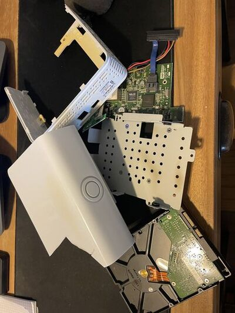
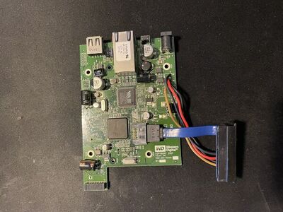
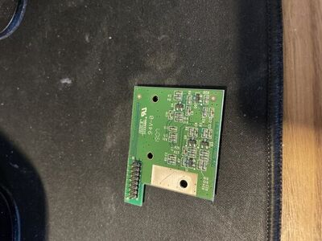

So back in graduate school (2007-2012), I had a Western Digital My Book World
Edition.  I used it for backing up my systems.   It was very cool at the time
to have my very own NAS.  Recently, I decided that I was going to try to clean
up all of my old hardware and unfortunately, when I plugged in the device, it
would not boot. Even thought I probably interacted with 100s of bad hard drives
when I worked at Apple, I had never once tried to do any data recovery.  So, I
had a day, why not try some data recovery?

I thought this was going to be easy.  I figured I would pop open the enclosure,
plug it in, grab any files worth keeping, done. What followed was a full-stack
debugging session across RAID metadata, filesystem internals, and hardware
failure — and a front-row seat to how old disks actually die under stress.

RIP WD drive, here's what happened.

---

## Shucking the Enclosure

The WD My Book World Edition is a consumer NAS that looks like a hard drive
stood on end. Getting the disk out, which I learned was called "shucking",
requires cracking open the plastic shell. There's no graceful way to do this;
it's plastic clips and patience.  I ended up cracking the shell in the process,
but that's okay, it was kind of ugly anyway.



The motherboard was shockingly similar to a rasburry pi, which would not be released for another (almost) 5 years.



Also in the enclosure was a neat little controller for the on/off button of the NAS.



Once the drive was free, I connected it via a powered SATA→USB dock on my NUC
running NixOS.


---

## What's Actually on the Disk

First step: see what we're working with.

```bash
lsblk -f
```

```
sdc
├─sdc1 linux_raid_member
├─sdc2 linux_raid_member
├─sdc3 linux_raid_member
└─sdc4 linux_raid_member
```

Every partition on the disk is a Linux MD RAID member. It caused me to scratch
my head as this is a *single-disk* consumer NAS, and yet the entire disk is
partitioned as RAID. That's seemed unusual, but after some thought, it does
kind of make sense. If WD can make everything use RAID, it should simplify all
their internal tooling.


So, I "visualized" the storage stack as:

```
disk → partitions → md RAID → ext3
```

And, that stack had some implications for recovery, as we'll see.

---

## Attempt 1: Assemble the RAID

The natural first move is to let the kernel do what it knows how to do.

```bash
modprobe md_mod
mdadm --assemble --scan
cat /proc/mdstat
```

I found three small partitions (sdc1–3) assembled, but in degraded state and a
larger partion (sdc4) that failed because of an invalid superblock checksum.

So I concluded that hte RAID metadata was corrupt. :(

---

## Attempt 2: Inspect the RAID Metadata

Before giving up on the RAID layer entirely, I wanted to understand what the
metadata actually said. `mdadm --examine` reads the superblock directly:

```bash
mdadm --examine /dev/sdc4
```

```
Raid Level : raid1
Raid Devices : 2
Total Devices : 1
Checksum mismatch
```

So this was a RAID1 mirror that expected two disks and one was present, moreover
the one we have had a corrupt superblock checksum. Side note, if you ask
"claude" about it, it will try to tell you that there is a drive missing, but
as we know, WD just configured single-disk devices as RAID1. Either way, the
metadata was damaged enough that the kernel couldn't assemble it.

---

## Attempt 3: Bypass the RAID Layer

With the RAID metadata corrupt, I started looking for a way around it. A bit
of research turned up a useful property of MD RAID v0.90: it stores its
superblock at the *end* of the partition rather than the beginning. That means
the actual filesystem data is sitting right at block zero, untouched.

I could verify this without mounting anything:

```bash
file -s /dev/sdc4
```

```
ext3 filesystem data
```

The filesystem was right there. If I could mount the partition directly —
ignoring the RAID layer entirely — I might be able to get to the data.

```bash
mount -t ext3 -o ro,norecovery /dev/sdc4 /mnt/oldnas
```

```
Structure needs cleaning
```

So, progress but, not quite. I checked the kernel logs to see what was actually
wrong:

```bash
dmesg
```

```
EXT4-fs: group descriptors corrupted
```

So even though the filesystem was detectable, its metadata was corrupt too. The
group descriptors — the index ext3 uses to find data blocks — were damaged, and
without them the kernel wouldn't mount it.  I was curious about the EXT4 based
messages as I was trying to mount as ext3, but could not track down an answer.

---

## Attempt 4: Filesystem Recovery

Okay, so the filesystem metadata was corrupt. The next idea: ext3 keeps backup
superblocks at known locations for exactly this situation. I used `mke2fs -n`
to calculate where they'd be without writing anything:

```bash
mke2fs -n /dev/sdc4
```

```
Superblock backups stored on blocks:
32768, 98304, 163840, ...
```

I also ran `fsck` to get a clearer picture of the damage:

```bash
fsck.ext3 -n /dev/sdc4
```

```
Group descriptors corrupted
journal superblock corrupt
```

Both the group descriptors and the journal were gone. I tried pointing `fsck`
at a backup superblock:

```bash
fsck.ext3 -n -b 32768 /dev/sdc4
```

```
invalid journal
cannot proceed
```

The backup superblock was fine, but `fsck.ext3` still wouldn't proceed because
the journal was corrupt. Last idea: drop down to `fsck.ext2`, which doesn't
care about the journal at all:

```bash
fsck.ext2 -n -b 32768 /dev/sdc4
```

This showed some promise, but then things got worse.

---

## Failure event

During fsck attempts the usb disconneced and I got an error where "Synchronize
Cache failed".  Then in quick sequence the disk disappeared (confirmed with lsblk),
the dock LED started flashing, and on reconnect the drive would not spin up.

My first thought was that the dock or power supply had given out. I swapped in
a different drive and the dock detected it cleanly — spun right up. So the
dock was fine. The original drive was just dead: no spin, not detected, gone.
Most likely a PCB or motor failure, probably right on the edge for years and
finally tipped over by the sustained I/O of the fsck attempts.

---

## Takeaways

So on reflection, a few things I learned:

1. Consumer NAS devices use layered storage even on a single disk:  I suspect
   that this is to create uniformity on WD products.

2. MD RAID v0.90 can be bypassed:  Because of that, the filesystem still
   mountable (in principle).

3. ext3 failure modes (and potential workarounds): The journal blocks can
   become corrupted but backup superblocks may still exist and recoverable if
   the disk is stable

4. Failure pattern followed the sequence: `filesystem corruption → fsck → heavy
   I/O → USB reset → disk death`

With some reflection, perhaps with a sensitive (old) disk, next time it may be
worth trying to (when possible) avoid `fsck` and random reads and definitely
work off a sequental image such as `ddrescue`.  Note that I did know about the
image as an option, but creating that image presented some disk space
challenges. Since I wasn't really concerned with getting the data back and in
reality only interested in the journey, finding a large enough disk to work off
of was not worth the effort.

So, I ended up with no data recovered, but I sure did have a fun time!
